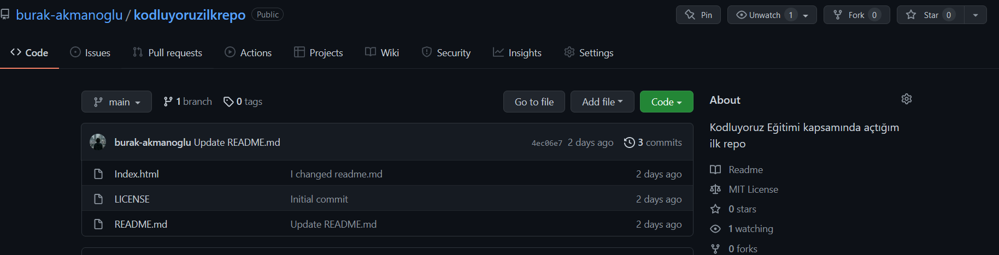

# Kodluyoruz Ilk Repo
Bu repo [Kodluyoruz](https://www.kodluyoruz.org) Başlangıç seviyesi .Net Core Eğitiminde oluşturduğumuz ile repo. İçerisinde bir adet READNE dosyası, bir adet index.html barındırıyor.



## Installation
Öncelikle projeyi clonelayın.

```bash
git clone https://github.com/burak-akmanoglu/kodluyoruzilkrepo.git
```
## Usage
Projeyi cloneladıktan sonra Visual Studio Code programını açınız.

Linux için:
```linux
cd kodluyoruzilkrepo
code .
```
## Contributing

Pull requestler kabul edilir. Büyük değişiklikler için, lütfen önce neyi değiştirmek istediğinizi tartışmak için bir konu açınız.

## License 
[MIT](https://choosealicense.com/licenses/mit/)
